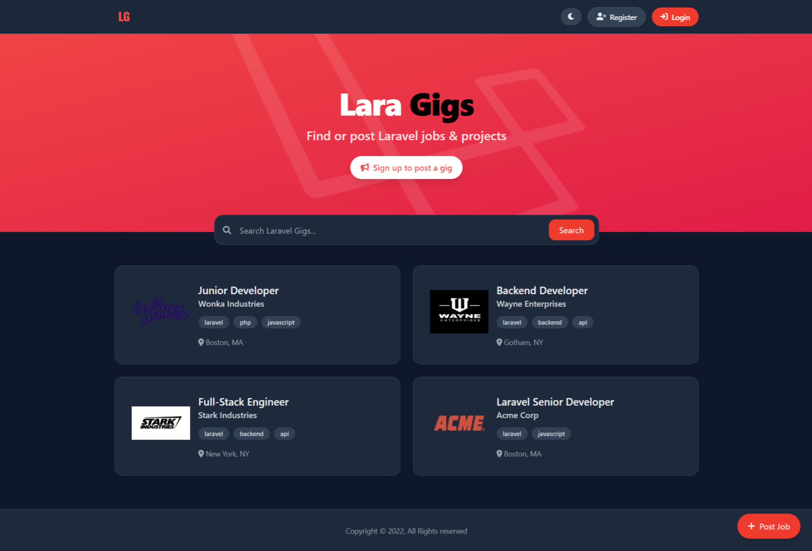

<h1 align="center">LaraJobs</h1>
<p align="center">
  A modern job listings platform built with <b>Laravel 12</b>, <b>Blade</b>, and <b>TailwindCSS</b>.
</p>



### 1. Project Overview

LaraJobs is a full‑stack Laravel application that showcases modern Laravel conventions, reusable Blade components, clean routing/controllers, and TailwindCSS styling. It includes authentication, CRUD for job listings, search by tags/keywords/location, pagination, and a custom 404 page.

### 2. Features

- **Browse job listings**: View a paginated feed of the latest jobs
- **Advanced search**: Filter by tags, keywords, and location
- **User authentication**: Register, login, logout
- **Employer dashboard**: Create, edit, and delete your listings
- **Pagination**: Clean pagination UI for long lists
- **Custom 404**: Friendly, branded not‑found page
- **Reusable UI**: Blade layouts and components for consistent design

### 3. Tech Stack

- **Backend**: Laravel 12, PHP 8+
- **Frontend**: Blade templates, TailwindCSS
- **Database**: MySQL (or SQLite)
- **Build tooling**: Laravel Vite (optional for asset builds)

### 4. Installation

Prerequisites:
- PHP 8+
- Composer
- MySQL or SQLite
- Node.js + npm (optional, for building frontend assets)

Steps:
1. Clone the repository

```bash
git clone <your-repo-url> larajobs
cd larajobs
```

2. Install PHP dependencies

```bash
composer install
```

3. Configure environment

```bash
cp .env.example .env
```

Update `.env` with your database settings. Examples:

MySQL

```env
DB_CONNECTION=mysql
DB_HOST=127.0.0.1
DB_PORT=3306
DB_DATABASE=larajobs
DB_USERNAME=root
DB_PASSWORD=
```

SQLite

```env
DB_CONNECTION=sqlite
DB_DATABASE=database/database.sqlite
```

Then create the file if using SQLite:

```bash
mkdir -p database && type NUL > database\database.sqlite
```

4. Generate the application key

```bash
php artisan key:generate
```

5. Run database migrations

```bash
php artisan migrate
```

6. (Optional) Seed sample data

```bash
php artisan db:seed
```

7. (Optional) Install/build frontend assets

```bash
npm install
npm run dev
```

8. Start the development server

```bash
php artisan serve
```

The app will be available at `http://127.0.0.1:8000`.

### 5. Usage

- **Register**: Navigate to `/register`, create an account, and sign in.
- **Post a job**: After logging in, go to "Create Listing" (or `/listings/create`), fill in details such as title, company, location, tags (comma‑separated), and description, then submit.
- **Manage listings**: Visit "Manage Listings" to edit or delete your own postings.
- **Edit a job**: From the manage screen or a listing page, click "Edit", update fields, and save.
- **Search jobs**:
  - Use the search bar to filter by keywords and location
  - Click on tag chips to filter by tag
  - Combine keywords and tags for more precise results

### 7. Contributing

Contributions are welcome!

1. Fork the repository
2. Create a feature branch: `git checkout -b feature/your-feature`
3. Commit your changes: `git commit -m "feat: add your feature"`
4. Push to your fork: `git push origin feature/your-feature`
5. Open a Pull Request

Please follow PSR standards and include tests where applicable.

### 8. License

This project is licensed under the **MIT License**. See `LICENSE` for details.

### Folder Structure Overview

Key folders in this project:

- `app/Http/Controllers/`: Application controllers (e.g., listings, users)
- `app/Models/`: Eloquent models (e.g., `Listing`, `User`)
- `routes/web.php`: Web routes for pages and actions
- `resources/views/`: Blade templates
  - `resources/views/components/`: Reusable Blade components (cards, tags, layout)
  - `resources/views/listings/`: Listing pages (index, show, create, edit, manage)
  - `resources/views/users/`: Auth views (register, login)
- `resources/css/` and `resources/js/`: Frontend assets (TailwindCSS, app JS)
- `public/`: Public assets served by the web server (images, compiled assets)
- `database/migrations/`: Database schema definitions
- `database/seeders/`: Database seeders for sample data

If you use Vite, compiled assets will be output per your Vite config.
