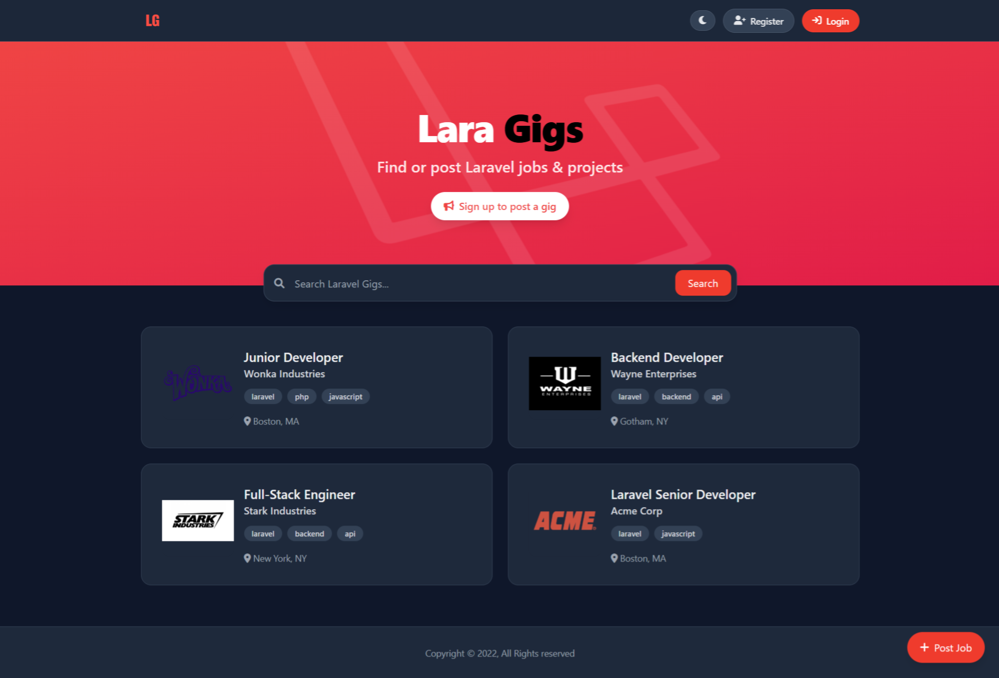

<h1 align="center">
  <br>
  LaraGigs
  <br>
  <sup>Modern Job Listings Platform</sup>
</h1>

<p align="center">
  <a href="#features">Features</a> •
  <a href="#installation">Installation</a> •
  <a href="#usage">Usage</a> •
  <a href="#api">API</a> •
  <a href="#testing">Testing</a> •
  <a href="#contributing">Contributing</a>
</p>

<p align="center">
  
  
  
  
</p>



## 📋 Overview

LaraGigs is a full-stack web application that connects employers with talent through a modern, intuitive job listings platform. Built with Laravel 12 and styled with TailwindCSS 4.0, it demonstrates best practices in modern web development including clean architecture, reusable components, and comprehensive testing.

## ✨ Features

### Core Functionality
- 🔍 **Advanced Search & Filtering** - Search by keywords, tags, and location
- 👤 **User Authentication** - Secure registration, login, and session management
- 📝 **Complete CRUD Operations** - Create, read, update, and delete job listings
- 🔒 **Authorization System** - Users can only manage their own listings
- 📄 **Pagination** - Efficient handling of large datasets
- 🏷️ **Tag System** - Categorize and filter listings by skills/technologies
- 📱 **Responsive Design** - Mobile-first approach with TailwindCSS

### Technical Features
- 🎨 **Blade Components** - Reusable UI components for consistency
- 🗄️ **Eloquent ORM** - Clean database interactions with relationships
- 🛡️ **CSRF Protection** - Security against cross-site request forgery
- 📤 **File Uploads** - Company logo uploads with validation
- 🔄 **Database Migrations & Seeders** - Version-controlled schema
- ⚡ **Vite Integration** - Fast HMR and optimized builds
- 🧪 **Pest Testing** - Modern testing framework

## 🛠️ Tech Stack

| Category | Technologies |
|----------|-------------|
| **Backend** | Laravel 12, PHP 8.2+ |
| **Frontend** | Blade Templates, TailwindCSS 4.0, Alpine.js |
| **Database** | MySQL 8.0+ / PostgreSQL / SQLite |
| **Build Tools** | Vite, npm |
| **Testing** | Pest, PHPUnit |
| **Development** | Laravel Sail (Docker), Laravel Pint (Code Style) |

## 📦 Installation

### Prerequisites

- PHP >= 8.2
- Composer >= 2.5
- Node.js >= 18.0 & npm >= 9.0
- MySQL >= 8.0 (or PostgreSQL/SQLite)
- Git

### Quick Start

1. **Clone the repository**
```bash
git clone https://github.com/yourusername/laragigs.git
cd laragigs
```

2. **Install PHP dependencies**
```bash
composer install
```

3. **Install Node dependencies**
```bash
npm install
```

4. **Environment setup**
```bash
cp .env.example .env
```

5. **Configure your database** in `.env`:

**For MySQL:**
```env
DB_CONNECTION=mysql
DB_HOST=127.0.0.1
DB_PORT=3306
DB_DATABASE=laragigs
DB_USERNAME=root
DB_PASSWORD=your_password
```

**For SQLite (Development):**
```env
DB_CONNECTION=sqlite
DB_DATABASE=database/database.sqlite
```

6. **Generate application key**
```bash
php artisan key:generate
```

7. **Create database** (SQLite only)
```bash
touch database/database.sqlite
```

8. **Run migrations**
```bash
php artisan migrate
```

9. **Seed sample data** (optional)
```bash
php artisan db:seed
```

10. **Build frontend assets**
```bash
npm run build
```

### 🚀 Running the Application

**Development mode with hot reload:**
```bash
npm run dev
```
This command runs the Laravel server, queue worker, and Vite dev server concurrently.

**Or run separately:**
```bash
# Terminal 1: Laravel server
php artisan serve

# Terminal 2: Vite dev server
npm run dev

# Terminal 3: Queue worker (if using jobs)
php artisan queue:listen
```

Visit `http://localhost:8000` to see the application.

## 📚 Usage

### User Workflows

#### For Job Seekers
1. Browse listings on the homepage
2. Use search bar for keywords/location
3. Click tags to filter by technology
4. View detailed listing information
5. Contact employers via provided email

#### For Employers
1. Register/login to your account
2. Click "Post Job" to create a listing
3. Fill in job details:
   - Job title and company name
   - Location (remote/on-site)
   - Required skills (comma-separated tags)
   - Job description
   - Company logo (optional)
4. Manage your listings from the dashboard
5. Edit or delete postings as needed

### Key Routes

| Method | URI | Description | Auth Required |
|--------|-----|-------------|---------------|
| GET | `/` | Homepage with all listings | No |
| GET | `/listings/{id}` | Single listing details | No |
| GET | `/listings/create` | Create listing form | Yes |
| POST | `/listings` | Store new listing | Yes |
| GET | `/listings/{id}/edit` | Edit listing form | Yes (owner) |
| PUT | `/listings/{id}` | Update listing | Yes (owner) |
| DELETE | `/listings/{id}` | Delete listing | Yes (owner) |
| GET | `/listings/manage` | User's listings dashboard | Yes |
| GET | `/register` | Registration form | No |
| POST | `/users` | Create new user | No |
| GET | `/login` | Login form | No |
| POST | `/users/authenticate` | Authenticate user | No |
| POST | `/logout` | Logout user | Yes |

## 🧪 Testing

### Running Tests

```bash
# Run all tests
php artisan test

# Run with coverage
php artisan test --coverage

# Run specific test suite
php artisan test --testsuite=Feature

# Run with Pest (if configured)
./vendor/bin/pest
```

### Test Structure
```
tests/
├── Feature/
│   ├── ListingTest.php
│   ├── AuthenticationTest.php
│   └── SearchTest.php
└── Unit/
    ├── ListingModelTest.php
    └── UserModelTest.php
```

## 🔧 Configuration

### Environment Variables

Key `.env` configurations:

```env
# Application
APP_NAME=LaraGigs
APP_ENV=local|production
APP_DEBUG=true|false
APP_URL=http://localhost

# Database
DB_CONNECTION=mysql|pgsql|sqlite
DB_HOST=127.0.0.1
DB_PORT=3306
DB_DATABASE=laragigs
DB_USERNAME=root
DB_PASSWORD=

# Mail (for notifications)
MAIL_MAILER=smtp
MAIL_HOST=mailhog
MAIL_PORT=1025

# Storage
FILESYSTEM_DISK=local|public|s3

# Queue
QUEUE_CONNECTION=sync|database|redis
```

### Storage Configuration

For production, configure file storage:

```bash
# Link storage directory
php artisan storage:link

# Set proper permissions
chmod -R 775 storage
chmod -R 775 bootstrap/cache
```

## 📁 Project Structure

```
laragigs/
├── app/
│   ├── Http/
│   │   ├── Controllers/
│   │   │   ├── ListingController.php
│   │   │   └── UserController.php
│   │   └── Middleware/
│   ├── Models/
│   │   ├── Listing.php
│   │   └── User.php
│   └── Policies/
│       └── ListingPolicy.php
├── database/
│   ├── migrations/
│   ├── factories/
│   └── seeders/
├── resources/
│   ├── views/
│   │   ├── components/
│   │   ├── listings/
│   │   └── users/
│   ├── css/
│   └── js/
├── routes/
│   └── web.php
├── tests/
├── public/
└── storage/
```

## 🤝 Contributing

We welcome contributions! Please follow these steps:

1. **Fork the repository**
2. **Create a feature branch**
```bash
git checkout -b feature/amazing-feature
```
3. **Commit your changes**
```bash
git commit -m 'feat: add amazing feature'
```
4. **Push to your fork**
```bash
git push origin feature/amazing-feature
```
5. **Open a Pull Request**

### Development Guidelines

- Follow [PSR-12](https://www.php-fig.org/psr/psr-12/) coding standards
- Run code formatter before committing:
```bash
./vendor/bin/pint
```
- Write tests for new features
- Update documentation as needed
- Use conventional commits format

## 📄 License

This project is licensed under the MIT License - see the [LICENSE](LICENSE) file for details.

## 🙏 Acknowledgments

- [Laravel](https://laravel.com) - The PHP Framework for Web Artisans
- [TailwindCSS](https://tailwindcss.com) - A utility-first CSS framework
- [Brad Traversy](https://www.traversymedia.com) - Original LaraGigs tutorial inspiration
